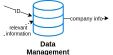

# PCATx CORE

### Table of Contents
---------------------
* Introduction
  * Milestone One
  * Milestone Two
* Classifier
* Data Management
* Parser
* Query Formulator
* Web Crawler

### Introduction
----------------

PCATx CORE is currently being developed as a web crawling and artificial intelligence framework for Praedicat, Inc. by the 2018 RIPS team at UCLA's Institute for Pure and Applied Mathematics. Our goal is to utilize Natural Language Processing techniques and Artificial Intelligence to automate data collection for the InsurTech company.

Analysts at Praedicat, Inc., need to manually associate each company with a set of business activities. Using this information, analysts attempt to find evidence linking businesses with potentially dangerous practices, such as the use of hazardous chemicals. With a plethora of companies and business activities, manual search is a tedious process. Further, the analysis is generally performed on unstructured, non-uniform, and sporadic Internet sites which makes it difficult to algorithmically search for the information needed and complex to determine the semantic meaning of the documents even when they are found. Our work attempts to tackle these problems by building a web crawler which procures information and comparing the statements found in the documents to a credible knowledge base. Based on computational fact checking, we are hoping this approach will lead to better classification of unstructured text information on the Internet.

  

##### Milestone One
-----------------

  

Milestone One is the web crawling part of our work. It consists of designing and implementing an intelligent web crawler that is able to find relevant information for Praedicat, Inc.'s analysts. Currently all of our work is focused on Milestone One.

##### Milestone Two
------------------

  

Milestone 2 is much more Natural Language Processing focused, we will be trying to automate refining, structuring, and interpreting the data as much as possible to make the job of Praedicat analysts as easy as possible. Ideally, we should be providing the analysts with a summary document for each company including the company's profile, the system's belief's about the company's associations with potential litigation causing agents, and sources. The simpler it is for the analyst to verify the better and although we would like to avoid all errors, we especially want to minimize Type II errors ("false negatives").

### Classifier
--------------

  

* Knowledge Graph --- [Documentation](knowledge_management/docs/KnowledgeGraph.md)\
Currently in development. We are hoping to use computational fact-checking and knowledge graph concepts to implement a classification and credibility checking module. To see the concepts and papers we are exploring, feel free to check out the "Computational Fact-Checking" section of my [AIReading Github](https://github.com/alexandermichels/AIReading#computational-fact-checking).

### Data Management

  

##### WebResourceManager

* [WebResourceManager.py](WebResourceManager.py) --- [Documentation](knowledge_management/docs/WebResourceManager.md)\
WebResourceManager is a class for helping manage a database of web resources. WebResourceManager creates a UUID (Universally Unique Identifier) for the web resource, saves the information in a JSON (labeled < UUID >.json), and builds maintain a dictionary from  URL to UUID. Using this uniform data storage system and a simple API, WebResourceManager makes storing and querying the contents and source files (such as HTML and PDF) of web resources much simpler.

##### ProfileManager

* [ProfileManager.py](ProfileManager.py) --- [Documentation](knowledge_management/docs/ProfileManager.md)\
ProfileManager is a class for helping manage a database of business profiles. It uses the SEC's (United States Securities and Exchange Commission) CIK codes (Central Index Key) to act as identifiers and allows the user to compile a variety of information on corporate entities in an easy to use and query format. Assisting the accessibility of information, ProfileManager supports using a series of mappings from CIK codes to names and back, names to aliases, and mappings from industry code standards and descriptions of them. The hope to provide for a flexible data solution for complex business oriented applications.

### Parser
----------

  

This is a parser that extracts visible and relevant content from webpages.
It can
* save original html pages and pdf contents
* write text files with the contents in a directory

##### Documentation

|Function | Input        | Processing           | Output  |
|-----   | ------------- |:-------------:| -----:|
|parser(linkList)    | a list of URLs      | create text files | None |
|tag_visible(element)    |  a string of webpage content   | determine if the content in a tag is visible and relevant | True/False|
|text_from_html(body)    |  a string of webpage content  | extract relevant content |a string of visible and relevant text|
|sentence_filter(sentence_list)| a list of sentences | remove non-sentences | a list of sentences after removal|

### Query Formulator
--------------------

  

### Web Crawler
---------------

  

[webcrawlAll.py](/webcrawlAll.py) is a set of modules to crawl various credible websites (TRI, EPA and SEC). Each of these modules is accessible from the module: `crawlerWrapper` which specifies various *engines*.
  * `google`: calls `search_google`.
  * `sec10k`: [*Deprecated*] constructs the url with `urlmaker_sec` and calls the `search_sec10k` for that CIK code.
  * `sec10kall`: engine is related to `sec10k`, but it runs for a CIK dict rather than a single CIK.
  * `secsic10k`: gets the 10-Ks related to that company for the SEC group.
  * `generalSEC`: make a general query to the SEC website, uses `urlmaker_sec`.
  * `sitespecific`:  Uses *httrack* to download index and PDFs from the input website.
  * `google-subs`: Pulls the subsidaries out of Google
  * `everything-all`: Pulls out the 10Ks, 8Ks, and E-21s for a CIK dictionary

Some of the helper modules are as follows:

1. `setDriver`: sets the driver using selenium; sets the types of arguments and the locates the drivers.

1. `urlmaker_sec`: creates a URL given the `searchText`, `formType` (10-K, 8-K, E-21 etc.), `cik`, `startDate`, `endDate`

1. `linkFilter_google`: filters out results received from social media websites

1. `search_google`: returns the search results from google for a particular query.

1. `search_sec10k`: [*Deprecated*] searches the SEC websites for the 10-K based on CIK
