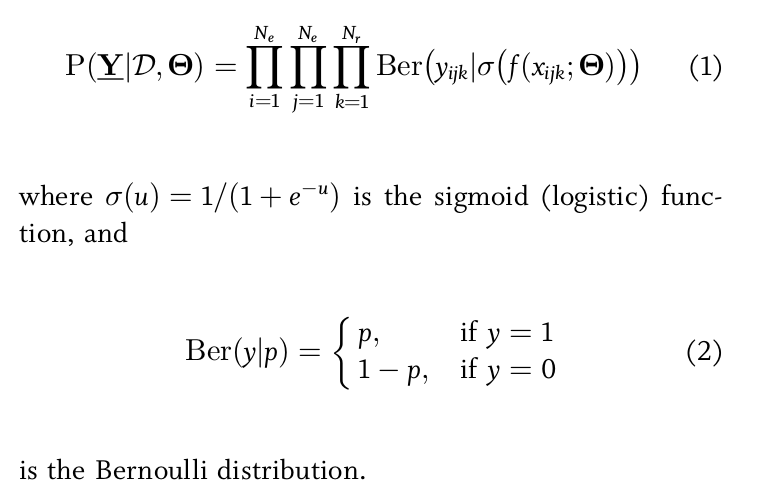

**Knowledge Graph**
----------------------

## Table of contents
* Introduction
* Types of Knowledge Graphs
* Properties of Knowledge Graphs
* Benefits of Using a Knowledge Graph
* Challenges

## Introduction

Currently in development. We are hoping to use computational fact-checking and knowledge graph concepts to implement a classification and credibility checking module. For an overview of Knowledge Graphs and Computational Fact-Checking, see [Computational Fact Checking from Knowledge Networks](https://github.com/alexandermichels/AIReading/blob/master/pdf/Computational_Fact_Checking_from_Knowledge_Networks.pdf) or [Towards Computational Fact-Checking](https://github.com/alexandermichels/AIReading/blob/master/pdf/Towards_Computational_Fact-Checking.pdf). I highly recommend [A Review of Relational Machine Learning for Knowledge Graphs](https://github.com/alexandermichels/AIReading/blob/master/pdf/A_Review_of_Relational_Machine_Learning_for_Knowledge_Graphs.pdf) for the relational learning concepts. To see all the concepts and papers we are exploring, feel free to check out the "Knowledge Graphs and Computational Fact-Checking" and "Relational Learning" sections of my [AIReading Github](https://github.com/alexandermichels/AIReading#computational-fact-checking).

## Types of Knowledge Graphs

#### Open versus Closed Word Assumption

The Open World Assumption (OWA) means that if a subject-predicat-object statement of fact is not present in the knowledge graph, we do not know if it is true or false. We are *open* to a world of new facts. This is generally the best assumption to go with as knowledge graphs are generally incomplete.

The Closed World Assumption (CWA) means that if a statement of fact is not present in the knowledge graph, we reject the fact as false. We are *closed* minded to a world of new facts. This approach can be justified after intensive training and when working with a large quantity of unreliable data.

The Local-Closed World Assumption (LCWA) assumes that the Knowledge graph is locally complete, but globally incomplete. So when presented with a statement of fact (*i*, *j*, *k*), if we already have observed a subject-predicate pair (*i*, *j*, \*) we will assume (*i*, *j*, *k*) is false. If we have not already observed a subject-predicate pair *i*,*j* than we put (*i*, *j*, *k*) in the unknown category.

We will likely have to use the Open World Assumption, but we might be able to use some kind of rule like the LCWA to help supervise.

#### Knowledge Base Construction

The information that informs the statements of fact in a knowledge graph can be gathered in a variety of ways, but the accuracy of the information greatly affects the usefulness of the final product. There are generally four approaches:

* curated approaches which feature experts manually constructing triples
* collaborative approaches which feature a group of volunteers manually constructing triples
* automated semistructured approaches which automatically extract information from semistructured sources using hand-crafted rules
* automated unstructured approaches which use Natural Language Processing and Machine Learning techniques

We will be using the last two.

#### Schema-Based vs. Schema-Free

Schema-Based Knowledge Graphs are able to avoid a class of problems known as Entity Resolution (See "Challenges/Entity Resolution" for more info) because they have a pre-specified vocabulary of subjects and predicates with unique identifiers. The problem with this approach is the inability to learn facts that lie outside of the predefined vocabulary of relations.

Schema-Free approaches use open information extraction to identify entities and relations and represent them using normalized by not disambiguated strings called "surface names." There are drawbacks to this approach in capturing semantic meaning.

I would like to see if we can use a fusion of the two approaches, at least at first. We would have a schema that includes aliases for our corporate entities, industries, etc. (because we already have the vocab), but also have the ability to add more IDs as we encounter what open information extraction perceives to be more entities and relations. Machine Learning (possibly Skip-Gram deep neural network using word2vec?) could help us in realizing which entities and relations should be mapped to the established vocabulary. Sounds fun?

## Properties of Knowledge Graphs

#### Adjacency Tensors and Possible Worlds

Formally, a knowledge graph is an ordered pair **G**=(**N**,**L**) where **N** is a set of entity or concept nodes and **L** is a set of predicate links. Let **E** = {e1, e2,...,eNe} be the set of entities in **G** and **R** = {r1, r2,...,rNr} be the set of all relation types in **G**. We can model the truth of each statement of fact, (*i*, *j*, *k*) where *i*,*k* are elements of **E** and *j* is an element of **R**, by the binary random variable y*ijk* in {0,1}. This means that all possible triples in **E** x **R** x **E** can be expressed by a third-order tensor whose entries are set such that y*ijk* = 1 if (*i*, *j*, *k*) in **G** and 0 otherwise. Extending from the matrix vocabulary, we will refer to this construct as an *adjacency tensor*. Each possible realization of our adjacency tensor represents a possible world and we are interested in estimating the joint distribution over possible worlds to predict the probability of triples based on the state of the known triples in our knowledge graph.

#### Hierarchical Types and Transitivity

Due to the way Knowledge Graphs hold relational data, they generally establish hierarchies within their data because of type constraints which is extremely helpful when it comes to querying and Natural Language Processing. For example, ("Leonard Nimoy", "is a", "actor") and all "actors" are "human/people" thus ("Leonard Nimoy", "is a", "person").

Along the same lines, the graph structure allows us to infer new facts through transitivity. ("Leonard Nimoy", "was born in", "Boston, MA") and ("Boston, MA", "is a city in", "United States"), thus ("Leonard Nimoy", "was born in", "United States").

#### Homophily

Besides mathematical/computer science theorems such as transitivity, there are "softer" patterns that can be exploited in graph representations of data. Among them is homophily or autocorrelation, or the tendency of individuals to associate and bond with similar others. This is also knows as link-based clustering or community detection. This is helpful for us because we can cluster entities based on links and from there infer links based on the what is known about similar entities. Social media does this when they realize that you and 30 other people all like the same 10 bands, so the social media platform recommends a band to you that the other 30 people also all like.

#### Block Structures

Knowledge graphs tend to be able to be divided up into "blocks" which are sets of entities such that all of the members of the set have similar relationships to the members of another block. This is analogous to, a bipartite matching. An example of two blocks would be "Science Fiction writers" and "Science Fiction franchises". All entities in the "Science Fiction writers" block would have the same relation ("authored") to an entity in the "Science Fiction franchises" block.

#### Statement of Fact Correlation

The presence or absence of subject-predicate-object triples is correlated with, and thus predictive of, the presence or absence of certain other statements of facts. Mathematically, this means the random variables y*ijk* are correlated with one another. This can use what is known to predict what could be also be true. There are three main ways to model the correlations between the subject-predicate-object triples:
* **Latent Feature Models** - Assume all y*ijk* are conditionally independent given the latent features associated with subject, object, and relational type and additional parameters
* **Graph Feature Models** - Assume all y*ijk* are conditionally independent give observed graph features and additional parameters
* **Markov Random Fields** - Assume all y*ijk* have local interactions

The models using the Latent Feature Models and Graph Feature Models predict the existence of a statement of fact y*ijk* using a score function f(x*ijk*; &Theta;) representing the system's confidence in the existence of the fact given the parameters &Theta;. The model can be written as follows where **Y** is the third-order tensor and *D* is the set of observed triples:

  

[image credits](https://github.com/alexandermichels/AIReading/blob/master/pdf/A_Review_of_Relational_Machine_Learning_for_Knowledge_Graphs.pdf)

## Benefits of Using a Knowledge Graph

#### Targeted Query Formulation through SRL and Link-Based Clustering

The field of Statistical Relational Learning already has a variety of tools for us to take advantage of and among them is the ability to predict new edges based on the edges present in the graph. Based on these predicted new edges, we can formulated queries to either confirm or deny the fact. This gives our system the ability to **infer** new information.

Representing our data as a graph also means we can say things about the entities based on the similarity of the nodes themselves, but also the similarities between the nodes they are connected to. This is well-studied field that is generally used in social media networks called link-based clustering or community detection. This is helpful for us because we can cluster entities based on links and from there **infer** links based on the what is known about similar entities. Social media does this when they realize that you and 30 other people all like the same 10 bands, so the social media platform recommends a band to you that the other 30 people also all like.

#### Logic Based Classification and Credibility Checking

Our attempts as keyword base classification failed because it was not robust enough. Mathematically, we were were including a document **D** if the proportion of words that were "relevant" (elements of the set of keywords) was above some threshold.

This approach would instead represent a document as a set of statements of fact {P1, P2,...,Pn} from some source **S**. If the document contains true statements we can accept the document regardless of the proportion of keywords, and reject it if it contains false statements. Furthermore, we can keep track of the source's history of providing true or false statements. This would allow us to implement competitive learning algorithms to prioritize trustworthy sources.

#### Aggregation and Queryability

Knowledge graphs are becoming more and more popular, it is used in Google's search engine and IBM's Watson, because it has the ability to cluster semantic information, which means that there are already frameworks out there for us. Not only do we have all of the tools and packages that come with Graph Theory, we also have tools and frameworks specifically designed for aggregating information into knowledge graphs and then querying in new and interesting ways. The [Resource Description Framework](https://en.wikipedia.org/wiki/Resource_Description_Framework) was designed as a data structure for holding subject-predicate-object triples as well as metadata about web-based resources and the [SPARQL Protocol and RDF Query Language](https://en.wikipedia.org/wiki/SPARQL) was designed for getting this information.

## Challenges

#### Converting Unstructed Data to Subject-Predicate-Object Triples

This is going to be the hardest part.

#### Entity Resolution

This problem is also known as Record Linkage, Object Identification, Instance Matching, and Deduplication. It is the problem of knowing when we have two instances of the same object in our knowledge graph and how to know when to automatically merge the nodes. To illustrate the problem, suppose we have ("Obama", "was born in", "Hawaii") and ("Barack Obama", "birthplace", "Hawaii"). Our system will be much more effective if it is able to recognize that "Obama" and "Barack Obama" are the same entity and is able to recognize that many relations (such as "was born in" and "birthplace") have the same semantic meaning.

## Sources

* [Automated Fact-Checking presentation by Joshua Chen](http://joshchen.io/Computational%20Fact-Checking/Automated%20fact-checking%20-%20Jul%2025.pdf)
* [Computational Fact Checking from Knowledge Networks](https://github.com/alexandermichels/AIReading/blob/master/pdf/Computational_Fact_Checking_from_Knowledge_Networks.pdf)
* [Computational Fact Checking through Query Perturbations](https://github.com/alexandermichels/AIReading/blob/master/pdf/Computational_Fact_Checking_through_Query_Perturbations.pdf)
* [Discriminative Predicate Path Mining for Fact Checking in Knowledge Graphs](https://github.com/alexandermichels/AIReading/blob/master/pdf/Discriminative_Predicate_Path_Mining_for_fact_checking_in_knowledge_graphs.pdf)
* [Open Information Extraction: The Second Generation](https://github.com/alexandermichels/AIReading/blob/master/pdf/Open_Information_Extraction_The_Second_Generation.pdf)
* [A Review of Relational Machine Learning for Knowledge Graphs](https://github.com/alexandermichels/AIReading/blob/master/pdf/A_Review_of_Relational_Machine_Learning_for_Knowledge_Graphs.pdf)
* [Towards Computational Fact-Checking](https://github.com/alexandermichels/AIReading/blob/master/pdf/Towards_Computational_Fact-Checking.pdf)
