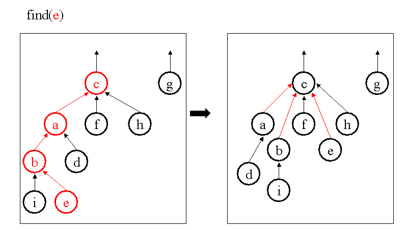

**Open Information Extraction**
-------------------------------

## Table of Contents
* Introduction
* Challenges
* Ideas
* Sources

## Introduction

Information extraction (IE) is the task of automatically extracting structured information from unstructured and/or semi-structured machine-readable documents. Traditionally, this has required extensive work crafting extraction rules or hand-tagging training examples and each relation of interest had to be specified either with rules or examples. The time investment also meant that IE was generally performed on small, structured, and homogeneous corpora allowing systems to use linguistic technologies that were not computational taxing and not very robust because they didn't have to be such as dependency parsers and Named-Entity Recognizers. As the size of the relations and the size of the corpus scale, all of these techniques become infeasible.

This problem was solved with the revolutionary introduction of Open Information Extraction by Banko, Cafarella, Soderland, Broadhead, and Etzioni, in their [2007 "Open Information Extraction from the Web"](https://github.com/alexandermichels/AIReading/blob/master/pdf/Open_Information_Extraction_from_the_Web.pdf). Open Information Extraction (IE) is the task of extracting assertions from large sets of documents (known as a corpora) without requiring a pre-specified vocabulary. Their TextRunner used a self-supervised learner to identify relational dependencies between nouns and form subject-predicate-object triples.

## Challenges in Open Information Extraction

We are working with impressive systems. Even the first OpenIE system, TextRunner used: a parser, sets of non-specific linguistic rules using Part-of-Speech tagging and Parse trees, self labeling of training data for a Naive Bayes classifier which is used by an extractor, and then a redundancy-based assessor module. However, language is extremely complex and Open (Unsupervised) Information Extraction is an incredibly difficult task with a set of hard to tackle problems.

#### Entity Resolution

Ironically, this is a problem with many names: Entity Resolution, Record Linkage, Object Identification, Instance Matching, and Deduplication, but it refers to the problem of knowing when two different labels are referring to same thing. For example, "Barack Obama" and "Obama", but not all are so easy. A closely related problem is relation resolution, knowing when two relations have the same semantic meaning. For example, ("X", "was founded by", "Y") and ("X", "was originally founded by", "Y") mean the same thing, but some small changes like that can drastically alter the meaning of a relational phrase, so it can be difficult to know when to merge two tuples.

#### Incoherent Extractions

Incoherent Extractions are relational phrases which have no meaningful interpretations. They occur because the extractor decides whether to include each word in a relational phrase on a case by case basis which often results in incomprehensible phrases such as "was central torpedo".  Incoherent extractions account for 1-7% of Open IE system outputs.

Approaches to solving this problem revolve around syntactic constraints on removal and inclusion of words. [Fader, Soderland, and Etzioni](https://github.com/alexandermichels/AIReading/blob/master/pdf/Identifying_Relations_for_Open_Information_Extraction.pdf) propose that every multi-word relation phrase must begin with a verb, end with a preposition, and be contiguous sequence of words in the sentence.

#### Uninformative Extractions

Uninformative extractions are those that omit critical information from the text resulting in a tuple that is no longer informative. simple example *"Faust made a deal with the devil"*. This approach would yield ("Faust", "made", "a deal") or ("Faust", "made", "the devil") both of which are wrong because this sentence contains a light verb construction which is a multi-word expressions composed a verb and a noun where the noun carries the semantic content of the predicate (i.e. "making the deal"). English has a variety of problems complicating this process. Uninformative extractions account for 4-7% of Open IE system outputs.

## Ideas to Improve

#### Type-based Path Compression

We are going to establish a lot of series of relations such as ("Company C", "owns", "Subsidiary S"), ("Subsidariary S", "owns", "Facility F"), ("Facility F", "produces", "Product P"), and ("Product P", "contains", "Hazard H"). Of course, in this path of relations, the truly important relations are not present: ("Company C", "uses", "Hazard H") and ("Subsidiary S", "uses", "Hazard H"). Although simple Graph Theory algorithms such as breadth-first search could likely draw that conclusion, this is time consuming and the length of the path isn't along with checks on relations won't always be reliable.

Similar to how up tree implementation of the disjoint-set data structure use path compression to save time complexity, we are hoping to use path compression to add the relations ("Company C", "uses", "Hazard H") and ("Subsidiary S", "uses", "Hazard H") when they are found on the graph. This will hopefully allow us to greatly decrease the time complexity and add the semantic information we are searching for to the graph explicitly. Our hope is that this can be done continuously and in an unsupervised manner simply by providing a type hierarchy and a few simple rules. For example, this the above example we are able to establish the direct edge because the hierarchy of each entity type declined or stayed the same from Company->Company->Facility->Product->Hazard. A path that goes up in hierarchy such as Company->Product->Company would not be a valid candidate for compression as Product->Company is a step up in hierarchy.

## Sources

* [From Information to Knowledge Harvesting Entities and Relationships from Web Sources](https://github.com/alexandermichels/AIReading/blob/master/pdf/From_Information_to_Knowledge_Harvesting_Entities_and_Relationships_from_Web_Sources.pdf)
* [Identifying Relations for Open Information Extraction](https://github.com/alexandermichels/AIReading/blob/master/pdf/Identifying_Relations_for_Open_Information_Extraction.pdf)
* [OpenIE-based approach for Knowledge Graph construction from text](https://github.com/alexandermichels/AIReading/blob/master/pdf/OpenIE-based_approach_for_Knowledge_Graph_construction_from_text.pdf)
* [Open Information Extraction from the Web](https://github.com/alexandermichels/AIReading/blob/master/pdf/Open_Information_Extraction_from_the_Web.pdf)
* [Open Information Extraction: The Second Generation](https://github.com/alexandermichels/AIReading/blob/master/pdf/Open_Information_Extraction_The_Second_Generation.pdf)
* [Retrieval Effectiveness on the Web](https://www.sciencedirect.com/science/article/pii/S030645730000039X)
* [Risk Information Extraction and Aggregation](https://github.com/alexandermichels/AIReading/blob/master/pdf/Risk_Information_Extraction_and_Aggregation.pdf)
* [Text Mining: The State of the Art and the Challenges](http://www.ntu.edu.sg/home/asahtan/papers/tm_pakdd99.pdf)
